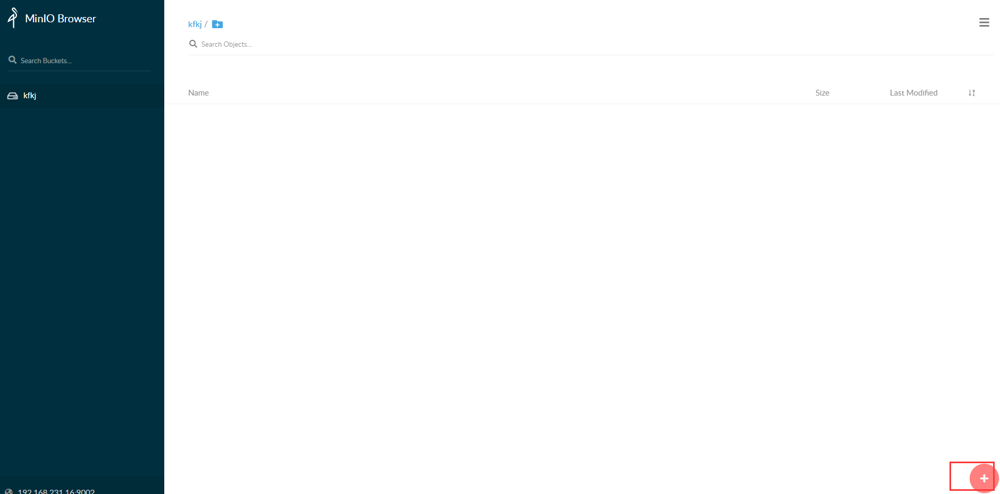

# 常用软件安装

## docker 安装

1.Docker的离线安装包，下载后解压
Docker安装一下离线包containerd.io，docker-ce-cli，docker-ce

2.安装Docker
将Docker的3个deb文件上传到服务器上面，然后用`sudo dpkg -i x.deb`，来一次安装。安装的顺序为：containerd.io，docker-ce-cli，docker-ce。

```bash
sudo dpkg -i containerd.io_1.4.6-1_amd64.deb
sudo dpkg -i docker-ce-cli_20.10.7_3-0_ubuntu-xenial_amd64.deb
sudo dpkg -i docker-ce_20.10.7_3-0_ubuntu-xenial_amd64.deb
```

3.启动Docker

```bash
#启动
sudo systemctl start docker
#查看docker动态
sudo systemctl status docker
#设置开机自启
sudo systemctl enable docker
sudo systemctl enable containerd
```


## docker-compose 安装

1.下载 Docker-compose离线包

2.安装Docker-compose
将下载下来的“docker-compose-linux-x86_64”文件上传到服务器上，然后执行如下命令将其移动到`/usr/local/bin`，并改名为“docker-compose”。

```bash

sudo mv docker-compose-linux-x86_64 /usr/local/bin/docker-compose
#接着执行如下命令添加可执行权限：
chmod +x /usr/local/bin/docker-compose
#使用 sudo docker-compose -v 命令测试是否安装成功
docker-compose -v
```


## mysql安装

1.将mysql8.2.tar文件拷贝到服务器，并执行安装镜像：

```bash
docker load < mysql8.2.tar
```

2.新建mysql目录

```bash
mkdir -p /data/mysql/conf
```

3.启动

MYSQL_ROOT_PASSWORD 密码设置

```
docker run --restart=always  -e TZ="Asia/Shanghai" --name mysql --privileged=true -d -p 3066:3306 -e MYSQL_ROOT_PASSWORD=xxxxx -v /data/mysql/data:/var/lib/mysql -v /data/mysql/conf:/etc/mysql/conf.d  mharbor.dpark.com.cn/kfzx/mysql:v8.2.0 --lower_case_table_names=1
```

4.注意点

mysql 默认的my.cnf是在容器`/etc/my.cnf`。业务需要增加配置可在`/etc/mysql/conf.d`目录自行创建`my.cnf`配置文件，然后外挂到服务器上`/data/mysql/conf`：


## postgres安装

1.将`postgis-v12.3.tar`文件拷贝到服务器，并执行安装镜像：

```bash
docker load < postgis-v12.3.tar
```

2.启动镜像

```bash
docker run -itd  -e TZ="Asia/Shanghai" --name postgis --restart=always -e POSTGRES_USER='postgres' -e POSTGRES_PASSWORD='xxxxxx' -p 54321:5432 -e ALLOW_IP_RANGE=0.0.0.0/0 -v /data/postgres/data:/var/lib/postgresql/data -d mharbor.dpark.com.cn/kfzx/postgis:v12.3 docker-entrypoint.sh postgres
```

3.更改最大连接数：


```bash
docker restart  postgis
```


## nginx安装

1.将`nginx-1.20.2.tar`文件拷贝到服务器，并执行安装镜像：

```bash
docker load < nginx-v1.24.0.tar
```

2.启动镜像，并创建目录，拷贝镜像文件

```bash
#启动镜像
docker run --name nginx1.24.0 -p 8080:80 -d mharbor.dpark.com.cn/kfzx/nginx:v1.24.0
 #创建配置文件目录
mkdir -p /data/nginx/html /data/nginx/conf.d /data/nginx/logs
#拷贝镜像文件
docker cp nginx1.24.0:/etc/nginx/nginx.conf /data/nginx/
docker cp nginx1.24.0:/etc/nginx/conf.d/ /data/nginx/
```

3.删除容器

```bash
docker rm -f nginx1.24.0
```

4.重新启动容器，挂载配置文件

```bash

#注意系统默认挂载的html位置是/usr/share/nginx/html,下面是挂载在/etc/nginx/html
 
docker run --restart=always --privileged=true  \
 -e TZ="Asia/Shanghai" -it -d --name nginx1.24.0  \
 -p 8080:80  \
-v /data/nginx/html:/etc/nginx/html  \
-v /data/nginx/nginx.conf:/etc/nginx/nginx.conf  \
-v /data/nginx/logs:/var/log/nginx  \
-v /data/nginx/conf.d/:/etc/nginx/conf.d/ \
mharbor.dpark.com.cn/kfzx/nginx:v1.24.0
```


## redis安装

1.将`redis-v6.2.6.tar`文件拷贝到服务器，并执行安装镜像：

```bash
docker load < redis-v6.2.6.tar
```

2.启动镜像

```bash
docker run -e TZ="Asia/Shanghai"  --name redis --restart=always -p 6379:6379   -v /data/redis:/data -d mharbor.dpark.com.cn/kfzx/redis:v6.2.6 docker-entrypoint.sh redis-server --requirepass xxxxx
```


## minio安装

1.将`minio-v1.tar`文件拷贝到服务器，并执行安装镜像：

```bash
docker load < minio-v1.tar
```

2.启动镜像

```bash
docker run -e TZ="Asia/Shanghai"   -p 9002:9000 --name minio -d --restart=always -e 'MINIO_ACCESS_KEY=admin' -e 'MINIO_SECRET_KEY=xxxxxxxx' -v /data/minio/data:/data mharbor.dpark.com.cn/kfzx/minio:v1 server data -address ":9000"
```

3.创建bucket

http://XXXX:9002/minio/




4.开启bucket读写权限


## elasticsearch安装

1.将elasticsearch-v7.17.10.tar文件拷贝到服务器，并执行安装镜像：

```bash
docker load < elasticsearch-v7.17.10.tar
```

2.创建挂载路径文件夹并授权

```bash
mkdir /data/elasticsearch
mkdir /data/elasticsearch/config
chmod 777 -R /data/
chmod 777 -R /data/elasticsearch/
chmod 777 -R  /data/elasticsearch/config
```

3.启动镜像

```bash
docker run -e TZ="Asia/Shanghai"  --name elasticsearch -p 9200:9200  -p 9300:9300 -e "discovery.type=single-node" -e ES_JAVA_OPTS="-Xms84m -Xmx512m" -d  mharbor.dpark.com.cn/kfzx/elasticsearch:v7.17.10
```

4.拷贝配置文件elasticsearch.yml，并删除容器

```bash
#复制配置文件
docker cp elasticsearch:/usr/share/elasticsearch/config/elasticsearch.yml  /data/elasticsearch/config/
#删除容器
docker rm -f elasticsearch
chmod 777 -R /data/elasticsearch/config/elasticsearch.yml
```

5.再次启动镜像

```bash
sudo docker run -e TZ="Asia/Shanghai"   --name elasticsearch -p 9200:9200  -p 9300:9300 -e "discovery.type=single-node" -e ES_JAVA_OPTS="-Xms84m -Xmx512m" -v /data/elasticsearch/config/elasticsearch.yml:/usr/share/elasticsearch/config/elasticsearch.yml -v /data/elasticsearch/data:/usr/share/elasticsearch/data -v /data/elasticsearch/plugins:/usr/share/elasticsearch/plugins -d mharbor.dpark.com.cn/kfzx/elasticsearch:v7.17.10
```

### 增加密码：
1.修改elasticsearch.yml文件

`vi /data/elasticsearch/config/elasticsearch.yml`

```bash
#添加如下内容
 http.cors.enabled: true
 http.cors.allow-origin: "*"
 http.cors.allow-headers: Authorization
 xpack.security.enabled: true
 xpack.security.transport.ssl.enabled: true
```

2.重启es

```bash
docker restart  elasticsearch 

#如果遇到错误就执行以下操作
chmod 777 -R /data/
docker restart elasticsearch
```

3.es重启完毕后，进入es容器

```bash
docker exec -it elasticsearch /bin/bash
```

执行以下命令

```bash
./bin/elasticsearch-setup-passwords interactive
```

会出现以下画面      


上边英文大概的意思是：你如果确定开启密码的话，需要设置以下六种账户的密码 elastic、apm_system、kibana、logstash_system、beats_system、remote_monitoring_user

输入y开始设置 都输入完成后，会出现以下画面


完成以上的设置后，需要再次重启ES容器

```bash
docker restart  elasticsearch 
```

