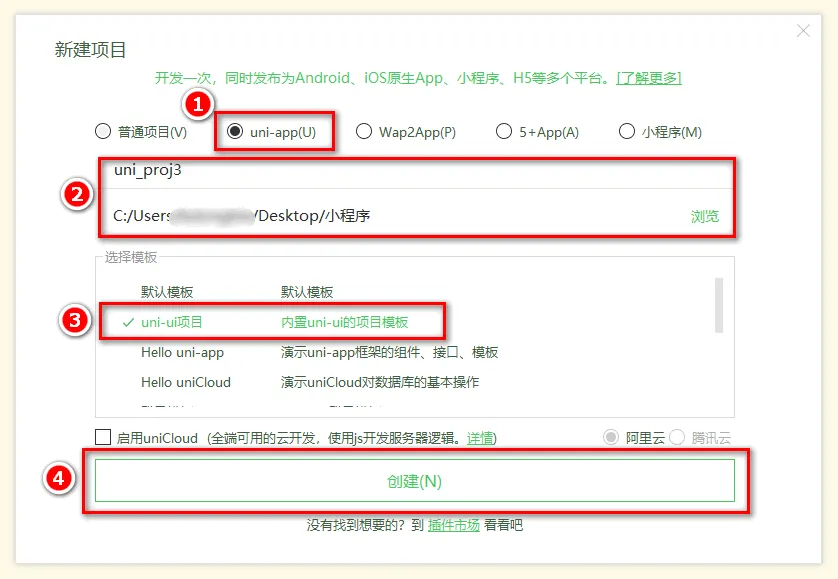
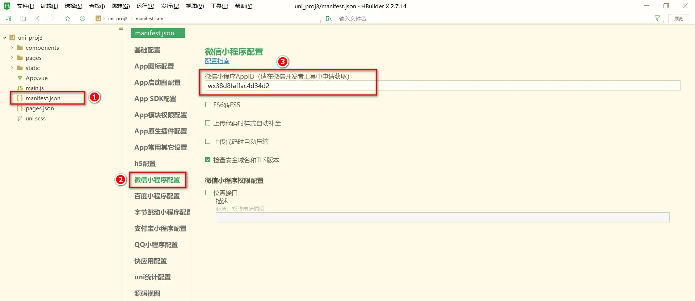
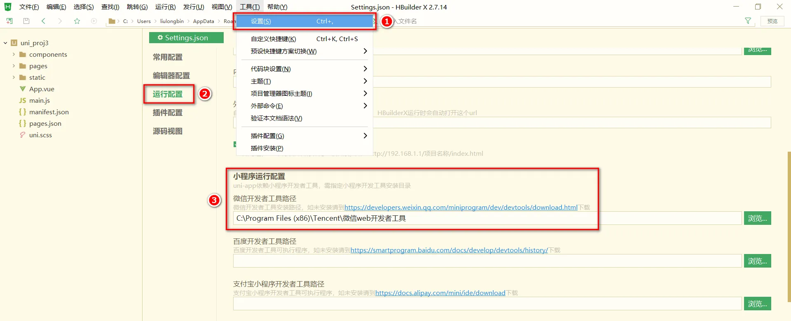
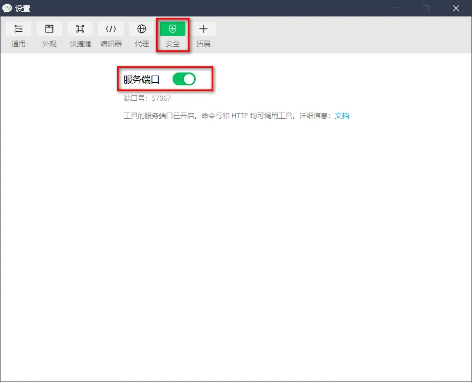

# uniapp 新建项目

## 文件 -> 新建 -> 项目 -> 填写项目基本信息



## 目录结构
```
┌─components            uni-app组件目录
│  └─comp-a.vue         可复用的a组件
├─pages                 业务页面文件存放的目录
│  ├─index
│  │  └─index.vue       index页面
│  └─list
│     └─list.vue        list页面
├─static                存放应用引用静态资源（如图片、视频等）的目录，注意：静态资源只能存放于此
├─main.js               Vue初始化入口文件
├─App.vue               应用配置，用来配置小程序的全局样式、生命周期函数等
├─manifest.json         配置应用名称、appid、logo、版本等打包信息
└─pages.json            配置页面路径、页面窗口样式、tabBar、navigationBar 等页面类信息
```

## 把项目运行到微信开发者工具
### 填写自己的微信小程序的 AppID：

### 在 HBuilderX 中，配置“微信开发者工具”的安装路径：

### 在微信开发者工具中，通过 设置 -> 安全设置 面板，开启“微信开发者工具”的服务端口：

### 在 HBuilderX 中，点击菜单栏中的 运行 -> 运行到小程序模拟器 -> 微信开发者工具，将当前 uni-app 项目编译之后，自动运行到微信开发者工具中，从而方便查看项目效果与调试：

## 在项目根目录中新建 .gitignore 忽略文件，并配置如下
```
# 忽略 node_modules 目录
/node_modules
/unpackage/dist
```