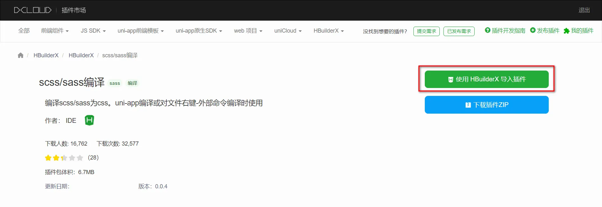
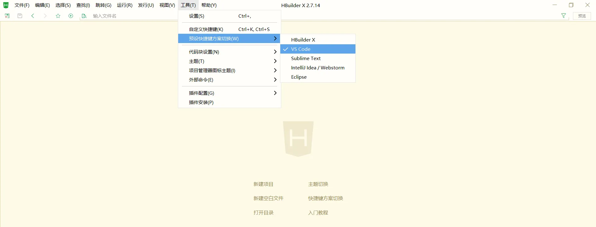
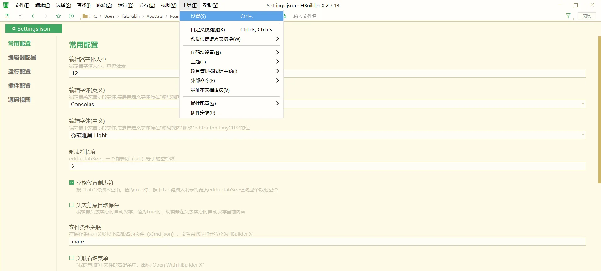

# 开发工具
## 下载 HBuilderX
1. 访问 HBuilderX 的官网首页 https://www.dcloud.io/hbuilderx.html
2. 点击首页的 DOWNLOAD 按钮
3. 选择下载 正式版 -> App 开发版
## 安装 HBuilderX
1. 将下载的 zip包 进行解压缩
2. 将解压之后的文件夹，存放到纯英文的目录中（且不能包含括号等特殊字符）
3. 双击 HBuilderX.exe 即可启动 HBuilderX

## 安装 scss/sass 编译
为了方便编写样式（例如：`<style lang="scss"></style>`），建议安装 scss/sass 编译 插件。插件下载地址：
https://ext.dcloud.net.cn/plugin?name=compile-node-sass
进入插件下载页面之后，点击右上角的 使用 HBuilderX 导入插件 按钮进行自动安装，截图如下


## 快捷键方案切换
操作步骤：工具 -> 预设快捷键方案切换 -> VS Code


## 修改编辑器的基本设置
操作步骤：工具 -> 设置 -> 打开 Settings.json 按需进行配置

源码视图下可用的参考配置：
```json
{
  "editor.colorScheme": "Default",
  "editor.fontSize": 12,
  "editor.fontFamily": "Consolas",
  "editor.fontFmyCHS": "微软雅黑 Light",
  "editor.insertSpaces": true,
  "editor.lineHeight": "1.5",
  "editor.minimap.enabled": false,
  "editor.mouseWheelZoom": true,
  "editor.onlyHighlightWord": false,
  "editor.tabSize": 2,
  "editor.wordWrap": true,
  "explorer.iconTheme": "vs-seti",
  "editor.codeassist.px2rem.enabel": false,
  "editor.codeassist.px2upx.enabel": false
}
```

